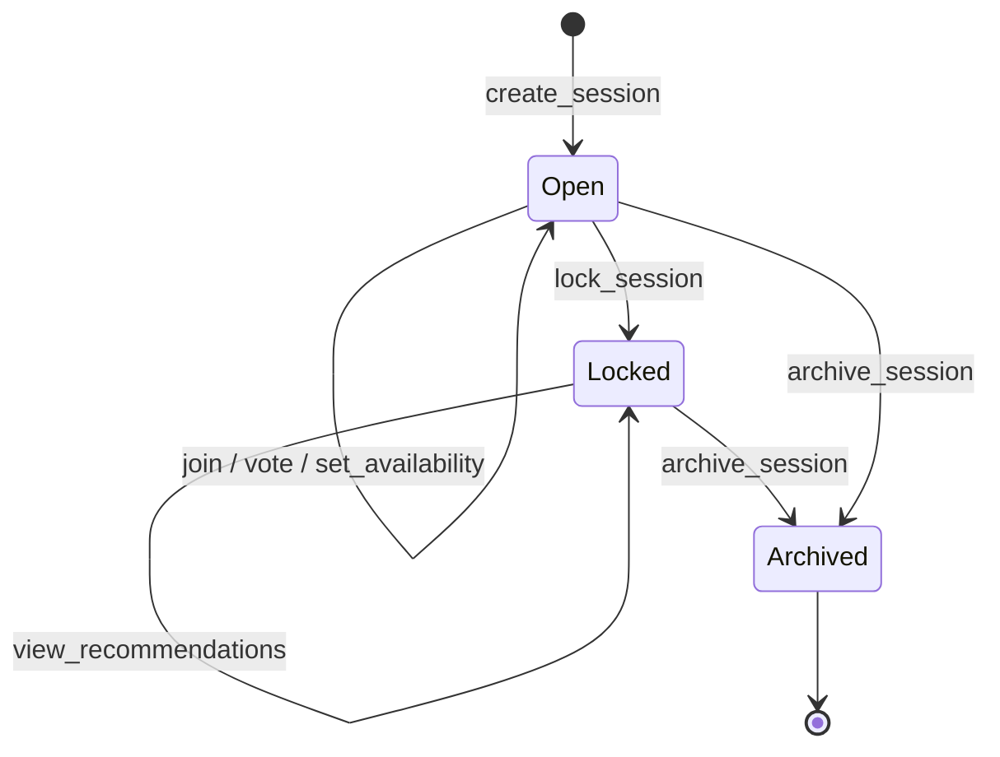
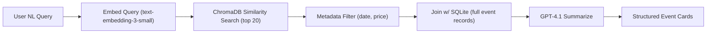

# YesCount -- Backend PRD

> Sub-PRD of [PRD_MASTER.md](PRD_MASTER.md)

---

## 1. Overview

YesCount runs as a single Streamlit application with no separate API server. All backend logic lives in Python modules imported by `app.py`. This document specifies the module structure, the RAG pipeline, the recommendation algorithm, the session lifecycle, error handling, and required environment variables.

---

## 2. Project Structure

```
src/
├── ingestion/
│   ├── __init__.py
│   ├── nyc_open_data.py      # Socrata API client
│   ├── web_scraper.py         # Scraping framework
│   └── normalizer.py          # Raw data -> events schema
├── db/
│   ├── __init__.py
│   ├── sqlite_client.py       # SQLite connection + CRUD
│   ├── chroma_client.py       # ChromaDB collection management
│   └── migrate.py             # Migration runner
├── rag/
│   ├── __init__.py
│   ├── embedder.py            # OpenAI embedding calls
│   ├── retriever.py           # ChromaDB query + rerank
│   └── llm_chain.py           # Prompt templates + GPT-4.1 calls
├── engine/
│   ├── __init__.py
│   ├── voting.py              # Record + tally votes
│   ├── availability.py        # Record slots + compute overlaps
│   ├── recommender.py         # Scoring algorithm
│   └── admin_rules.py         # Admin preference schema + filters
├── sessions/
│   ├── __init__.py
│   └── manager.py             # Session CRUD + URL generation
└── utils/
    ├── __init__.py
    └── invite_text.py          # Shareable invite text generation
```

---

## 3. Module Specifications

### 3.1 `ingestion/nyc_open_data.py`

**Purpose:** Fetch event listings from the NYC Open Data Socrata API.

**Key functions:**

| Function | Signature | Description |
|----------|-----------|-------------|
| `fetch_events` | `(dataset_id: str, limit: int = 1000, offset: int = 0) -> list[dict]` | Paginated GET to Socrata. Returns raw JSON rows. |
| `fetch_all_events` | `(dataset_id: str) -> list[dict]` | Auto-paginates until all rows are retrieved. |

**Implementation notes:**
- Uses `requests` with the Socrata app token in the `X-App-Token` header.
- Rate limit: 1,000 requests/hour for authenticated clients. Back off with exponential retry (base 2s, max 60s, 3 retries).
- Filter server-side with SoQL `$where` clause: `start_date_time > '{cutoff_date}'` to fetch only future events.

### 3.2 `ingestion/web_scraper.py`

**Purpose:** Scrape event data from target websites.

**Key functions:**

| Function | Signature | Description |
|----------|-----------|-------------|
| `scrape_site` | `(config: SiteConfig) -> list[dict]` | Fetch + parse a single site using its config. |
| `scrape_all` | `() -> list[dict]` | Iterate over all configured sites. |

**`SiteConfig` dataclass:**

```python
@dataclass
class SiteConfig:
    name: str               # human-readable site name
    base_url: str
    list_selector: str      # CSS selector for event list items
    field_map: dict         # CSS selectors for title, date, location, etc.
    pagination: dict | None # next-page selector and max pages
```

**Implementation notes:**
- Uses `requests` + `BeautifulSoup` for static HTML sites.
- Playwright support deferred to a future milestone for JS-rendered sites.
- Site configs stored in `config/scraper_sites.yaml`.
- Each scraper run logs the number of events found per site.

### 3.3 `ingestion/normalizer.py`

**Purpose:** Map raw event data (from any source) into the canonical `events` table schema.

**Key functions:**

| Function | Signature | Description |
|----------|-----------|-------------|
| `normalize_nyc_open_data` | `(raw: dict) -> dict` | Map Socrata fields to `events` columns. |
| `normalize_scraped` | `(raw: dict, source_name: str) -> dict` | Map scraper output to `events` columns. |
| `parse_date` | `(date_str: str) -> str` | Best-effort date parsing to ISO 8601 using `dateutil.parser`. |
| `parse_price` | `(price_str: str) -> tuple[float | None, float | None]` | Extract (min, max) from strings like "$10-$25", "Free", "$15". |
| `extract_vibe_tags` | `(text: str) -> list[str]` | Keyword-match against a curated vibe vocabulary. |

**Vibe vocabulary** (initial set, stored in `config/vibe_tags.yaml`):

```yaml
- immersive
- artsy
- outdoor
- low-key
- high-energy
- music
- comedy
- food
- sports
- nightlife
- family-friendly
- free
```

### 3.4 `db/sqlite_client.py`

**Purpose:** Thin wrapper around SQLite for all CRUD operations.

**Key functions:**

| Function | Signature | Description |
|----------|-----------|-------------|
| `get_connection` | `() -> sqlite3.Connection` | Returns a connection with WAL mode and foreign keys enabled. |
| `upsert_event` | `(event: dict) -> int` | Insert or update on `(source, source_id)` conflict. Returns row id. |
| `get_events` | `(filters: dict | None = None) -> list[dict]` | Query events with optional date/price/source filters. |
| `get_event_by_id` | `(event_id: int) -> dict | None` | Single event lookup. |
| `create_session` | `(session: dict) -> str` | Insert a session row. Returns the UUID. |
| `get_session` | `(session_id: str) -> dict | None` | Fetch session by UUID. |
| `update_session_status` | `(session_id: str, status: str) -> None` | Transition session status. |
| `add_participant` | `(session_id: str, name: str) -> int` | Insert participant. Returns participant id. |
| `get_participants` | `(session_id: str) -> list[dict]` | List participants in a session. |
| `upsert_vote` | `(session_id: str, participant_id: int, event_id: int, interested: bool) -> None` | Record or update a vote. |
| `get_votes` | `(session_id: str) -> list[dict]` | All votes in a session. |
| `upsert_availability` | `(session_id: str, participant_id: int, date: str, time_start: str, time_end: str) -> None` | Record an availability slot. |
| `get_availability` | `(session_id: str) -> list[dict]` | All availability slots in a session. |
| `get_top_voted_events` | `(session_id: str, limit: int = 3) -> list[dict]` | Top-N events by yes-vote count for the session preview. Returns `[{"title": ..., "vote_count": ...}]`. |

**Connection management:** Uses a module-level singleton connection with `check_same_thread=False` (safe because Streamlit serializes script runs per session).

**Write safety requirements:**
- All SQL writes must use parameterized statements (`?` placeholders). String interpolation in SQL is forbidden.
- Mutating operations (`create_session`, `add_participant`, `upsert_vote`, `upsert_availability`, `update_session_status`) execute inside explicit transactions (`BEGIN` / `COMMIT` / `ROLLBACK`).
- `lock_session` must be atomic and conditional (only succeeds if current status is `open`), so duplicate lock attempts are safe.

### 3.5 `db/chroma_client.py`

**Purpose:** Manage the ChromaDB `event_embeddings` collection.

**Key functions:**

| Function | Signature | Description |
|----------|-----------|-------------|
| `get_collection` | `() -> chromadb.Collection` | Returns or creates the `event_embeddings` collection with cosine distance. |
| `upsert_event_embedding` | `(event_id: int, document: str, metadata: dict, embedding: list[float]) -> None` | Upsert a single event embedding. |
| `upsert_batch` | `(ids: list[str], documents: list[str], metadatas: list[dict], embeddings: list[list[float]]) -> None` | Batch upsert. |
| `query` | `(query_embedding: list[float], n_results: int = 20, where: dict | None = None) -> dict` | Similarity search with optional metadata filter. |
| `delete_event` | `(event_id: int) -> None` | Remove an event from the collection. |

### 3.6 `rag/embedder.py`

**Purpose:** Generate embeddings using the OpenAI API.

**Key functions:**

| Function | Signature | Description |
|----------|-----------|-------------|
| `embed_text` | `(text: str) -> list[float]` | Embed a single text string. Returns 1536-dim vector. |
| `embed_batch` | `(texts: list[str], batch_size: int = 100) -> list[list[float]]` | Batch embedding with chunked API calls. |

**Implementation notes:**
- Model: `text-embedding-3-small`.
- Batch calls to OpenAI's `client.embeddings.create()` with up to 100 texts per request.
- Retry on rate-limit errors (HTTP 429) with exponential backoff.

### 3.7 `rag/retriever.py`

**Purpose:** Given a natural-language query, retrieve the most relevant events.

**Key function:**

```python
def retrieve_events(
    query: str,
    n_results: int = 20,
    date_range: tuple[str, str] | None = None,
    price_max: float | None = None,
) -> list[dict]:
    """
    1. Embed the query via embedder.embed_text().
    2. Build a ChromaDB `where` filter from date_range and price_max.
    3. Call chroma_client.query() to get top-n_results.
    4. Join with SQLite to get full event records.
    5. Return list of event dicts sorted by relevance score.
    """
```

**Metadata filtering in ChromaDB:**

```python
where_clause = {}
if date_range:
    where_clause["date_start"] = {"$gte": date_range[0], "$lte": date_range[1]}
if price_max is not None:
    where_clause["price_min"] = {"$lte": price_max}
```

### 3.8 `rag/llm_chain.py`

**Purpose:** Generate human-friendly summaries and answers using GPT-4.1.

**Key functions:**

| Function | Signature | Description |
|----------|-----------|-------------|
| `summarize_events` | `(events: list[dict], query: str) -> str` | Given retrieved events and the original query, produce a summary. |
| `generate_event_card` | `(event: dict) -> dict` | Generate a short tagline and vibe label for a single event card. |

**Prompt template for `summarize_events`:**

```
You are a helpful NYC event concierge. The user asked: "{query}"

Here are the most relevant upcoming events:

{formatted_event_list}

Provide a concise, friendly summary of the top options. Highlight why each
matches the user's request. Include date, location, and price for each.
Format as a numbered list.
```

**Structured output:** Use OpenAI's `response_format={"type": "json_object"}` when a structured response is needed (e.g., `generate_event_card` returns `{"tagline": "...", "vibe": "..."}`).

### 3.9 `engine/voting.py`

**Purpose:** Record and tally interest votes.

**Key functions:**

| Function | Signature | Description |
|----------|-----------|-------------|
| `cast_vote` | `(session_id: str, participant_id: int, event_id: int, interested: bool) -> None` | Persist a vote via `sqlite_client.upsert_vote`. |
| `get_vote_tallies` | `(session_id: str) -> dict[int, VoteTally]` | Returns `{event_id: VoteTally(yes_count, total_votes, voters)}`. |
| `get_participant_votes` | `(session_id: str, participant_id: int) -> list[dict]` | All votes by one participant. |

**Idempotency requirement:** repeated calls to `cast_vote` for the same `(session_id, participant_id, event_id)` must update in place and not create duplicate rows.

### 3.10 `engine/availability.py`

**Purpose:** Record availability and compute group overlap.

**Key functions:**

| Function | Signature | Description |
|----------|-----------|-------------|
| `set_availability` | `(session_id: str, participant_id: int, slots: list[dict]) -> None` | Bulk-upsert availability slots for a participant. |
| `get_group_availability` | `(session_id: str) -> dict[str, dict[str, list[str]]]` | Returns `{date: {time_slot: [participant_names]}}`. |
| `compute_overlap_matrix` | `(session_id: str) -> list[OverlapCell]` | Returns a list of `OverlapCell(date, time_start, time_end, participants, overlap_score)` sorted by overlap score descending. |

**Idempotency requirement:** submitting the same slot set multiple times for a participant produces the same stored result (no duplicates).

**`overlap_score` calculation:**

```
overlap_score = len(participants_in_slot) / total_participants_in_session
```

A score of 1.0 means everyone is available; 0.0 means no one.

### 3.11 `engine/recommender.py`

**Purpose:** Compute the best event-time combinations for the group.

**Scoring formula:**

```
score(event, slot) = (w_interest * interest_score)
                   + (w_overlap * overlap_score)
                   + (w_admin   * admin_score)
```

Where:
- `interest_score` = `yes_votes_for_event / total_participants` (range 0-1)
- `overlap_score` = from `availability.compute_overlap_matrix()` (range 0-1)
- `admin_score` = 1.0 if event passes all admin rules, 0.0 if it fails any hard rule, partial credit for soft rules

Default weights: `w_interest = 0.4`, `w_overlap = 0.4`, `w_admin = 0.2`.

**Key functions:**

| Function | Signature | Description |
|----------|-----------|-------------|
| `compute_recommendations` | `(session_id: str, top_n: int = 5) -> list[Recommendation]` | Returns top-N `Recommendation(event, slot, score, breakdown, attendees)`. |
| `rank_events_only` | `(session_id: str) -> list[dict]` | Rank events by interest alone (for pre-availability phase). |

**Tiebreaker rules** (applied in order when scores are equal):
1. Higher overlap score wins.
2. Lower price wins.
3. Earlier date wins.

### 3.12 `engine/admin_rules.py`

**Purpose:** Define and apply the Connector's priority constraints.

**`AdminPreferences` dataclass:**

```python
@dataclass
class AdminPreferences:
    budget_cap: float | None = None         # max price_min; None = no limit
    vibe_tags: list[str] = field(default_factory=list)  # preferred vibes
    min_attendees: int = 2                  # minimum participants with overlap
    blackout_dates: list[str] = field(default_factory=list)  # YYYY-MM-DD
    date_range_start: str | None = None
    date_range_end: str | None = None
```

**Key functions:**

| Function | Signature | Description |
|----------|-----------|-------------|
| `load_preferences` | `(session_id: str) -> AdminPreferences` | Parse `admin_preferences_json` from the session row. |
| `apply_hard_filters` | `(events: list[dict], prefs: AdminPreferences) -> list[dict]` | Remove events that violate budget cap, blackout dates, or date range. |
| `compute_admin_score` | `(event: dict, prefs: AdminPreferences) -> float` | 0.0-1.0 score based on vibe tag match ratio. |

**Hard vs. soft rules:**
- **Hard:** `budget_cap`, `blackout_dates`, `date_range_start/end` -- events that fail are excluded entirely.
- **Soft:** `vibe_tags`, `min_attendees` -- contribute to score but don't exclude.

### 3.13 `sessions/manager.py`

**Purpose:** Manage the full session lifecycle.

**Key functions:**

| Function | Signature | Description |
|----------|-----------|-------------|
| `create_session` | `(name: str, created_by: str, preferences: AdminPreferences) -> str` | Generate UUID, insert session row, return UUID. |
| `get_session_url` | `(session_id: str) -> str` | Build the shareable URL: `{base_url}?session={uuid}`. |
| `get_session_preview` | `(session_id: str) -> SessionPreview` | Public preview for the join screen (no auth required). See below. |
| `join_session` | `(session_id: str, participant_name: str) -> int` | Add participant, return participant ID. Raises if session is locked/expired. |
| `lock_session` | `(session_id: str) -> None` | Set status to `locked`. No more votes or availability after this. |
| `archive_session` | `(session_id: str) -> None` | Set status to `archived`. |
| `is_session_valid` | `(session_id: str) -> bool` | Check existence, status != archived, not past `expires_at`. |
| `get_session_summary` | `(session_id: str) -> dict` | Returns participant count, vote count, availability count. |

**Access and anti-abuse requirements:**
- No full account system is required for MVP, but all write actions are scoped to a valid, non-expired session.
- `get_session_preview` is read-only and public, but must be rate-limited per client (for example, 10 requests/minute).
- `join_session` validates participant names (trimmed, non-empty, max length 50, safe character set) before DB writes.
- Session participant limit is enforced server-side (max 10 participants per session).
- Duplicate names are deterministic: if `(session_id, name)` already exists, return the existing participant ID (idempotent join).

**Session lifecycle state machine:**



**`SessionPreview` dataclass (returned by `get_session_preview`):**

```python
@dataclass
class SessionPreview:
    session_id: str
    session_name: str           # e.g. "Crew Night Out"
    created_by: str             # e.g. "Ema"
    status: str                 # "open" | "locked" | "archived"
    participant_names: list[str]  # ["Ema", "Jake", "Mia"]
    participant_count: int
    top_events: list[dict]      # [{"title": "Jazz in the Park", "vote_count": 3}, ...]
    vibe_tags: list[str]        # from admin preferences
    date_range_start: str | None
    date_range_end: str | None
```

**`get_session_preview` implementation notes:**

This is a read-only aggregate query that requires no authentication. It joins across `sessions`, `participants`, `votes`, and `events` to build the preview:

1. Fetch the session row for `session_name`, `created_by`, `status`, and `admin_preferences_json`.
2. Fetch all participant names from `participants` where `session_id` matches.
3. Aggregate votes: `SELECT event_id, COUNT(*) as vote_count FROM votes WHERE session_id = ? AND interested = 1 GROUP BY event_id ORDER BY vote_count DESC LIMIT 3`.
4. Join the top event IDs with `events` to get titles.
5. Parse `admin_preferences_json` to extract `vibe_tags` and `date_range_start/end`.

The title displayed on the frontend is constructed as: `"Join {created_by}'s {session_name}!"` (e.g., "Join Ema's Crew Night Out!").

### 3.14 `utils/invite_text.py`

**Purpose:** Generate copy-paste-ready invite messages.

**Key function:**

```python
def generate_invite(
    recommendation: Recommendation,
    session_url: str,
) -> str:
    """
    Returns a text block like:

    🎉 YesCount Pick: {event.title}
    📅 {event.date_start} | 📍 {event.location} | 💰 {price_display}
    👥 {attendee_names} are in!
    🔗 {event.url}

    Vote & RSVP: {session_url}
    """
```

---

## 4. RAG Pipeline Detail



**Step-by-step:**

1. **Embed query**: `embedder.embed_text(user_query)` -> 1536-dim vector.
2. **Similarity search**: `chroma_client.query(embedding, n_results=20, where=metadata_filters)`.
3. **Metadata filter**: ChromaDB applies `$where` filters for date range and price at query time.
4. **SQL join**: For each returned `event_id`, fetch the full record from SQLite via `sqlite_client.get_event_by_id()`.
5. **LLM summarize**: Pass the top events + original query to `llm_chain.summarize_events()`.
6. **Return**: Structured event card data (title, tagline, date, location, price, URL, vibe tags).

---

## 5. Error Handling and Retry Strategy

| Scenario | Strategy |
|----------|----------|
| OpenAI API rate limit (429) | Exponential backoff: 2s, 4s, 8s. Max 3 retries. Log warning. |
| OpenAI API error (5xx) | Retry up to 2 times with 5s delay. Surface error to user on final failure. |
| Socrata API rate limit | Exponential backoff: 2s, 4s, 8s. Max 3 retries. |
| Socrata API timeout | 30s timeout per request. Retry once. |
| Web scraper HTTP error | Log and skip the failing site. Continue with other sites. |
| Web scraper parse error | Log the raw HTML snippet + error. Skip the malformed event. |
| SQLite write conflict | WAL mode avoids most conflicts. Retry once on `SQLITE_BUSY`. |
| ChromaDB upsert failure | Retry once. Log and skip on second failure (event remains in SQLite). |
| Session expired | Return a user-friendly "Session expired" page with option to create a new one. |
| Missing event fields | Fill with defaults (empty string, NULL for optional fields). Log a warning. |

**Retry boundaries and dependency behavior:**
- All external network calls must define timeouts (no unbounded waits).
- Retries are bounded; if exhausted, return a typed error and degrade gracefully where possible.
- If ChromaDB is unavailable, retrieval falls back to metadata-filtered SQLite search (without semantic ranking).
- If OpenAI summarization fails, return raw event cards without LLM summary rather than failing the entire flow.

**Structured error contract:**
- Errors surfaced to frontend must include: `error_code`, `message`, `retryable` (bool), and `context_id` for log correlation.

---

## 6. Environment Variables

| Variable | Required | Default | Description |
|----------|----------|---------|-------------|
| `OPENAI_API_KEY` | Yes | -- | OpenAI API key for embeddings and chat |
| `NYC_OPEN_DATA_APP_TOKEN` | Yes | -- | Socrata API app token for higher rate limits |
| `SQLITE_DB_PATH` | No | `data/yescount.db` | Path to the SQLite database file |
| `CHROMA_PERSIST_DIR` | No | `data/chroma/` | ChromaDB persistence directory |
| `SESSION_EXPIRY_DAYS` | No | `7` | Number of days before a session expires |
| `LOG_LEVEL` | No | `INFO` | Python logging level |
| `BASE_URL` | No | `http://localhost:8501` | Base URL for generating shareable session links |

All variables are loaded via `os.getenv()` with fallback defaults where applicable. A `.env.example` file documents every variable.

### 6.1 Startup Validation

App startup must fail fast when critical configuration is invalid:

1. Required keys exist: `OPENAI_API_KEY`, `NYC_OPEN_DATA_APP_TOKEN`.
2. Runtime paths are writable/readable for configured storage locations.
3. `SESSION_EXPIRY_DAYS` parses to a positive integer.
4. `BASE_URL` must not be left as localhost in deployed environments.
5. Pending migrations are applied (or startup exits with a clear migration error).

### 6.2 Logging Requirements

Use structured logs for operational visibility. Every backend log event should include:
- `timestamp`
- `level`
- `module`
- `operation`
- `session_id` (when applicable)
- `participant_id` (when applicable)
- `error_code` (for failures)
- `duration_ms` (for external calls and DB writes)

### 6.3 Scheduling Ownership

Scheduled jobs must be explicitly owned and monitored:
- **Daily ingestion job:** refresh events and embeddings at least once per day.
- **Session cleanup job:** archive or purge expired sessions on a daily schedule.
- If a scheduled job fails, log at error level and emit an operational alert signal.

## 7. Health Checks

The backend exposes health signals used for deploy validation:

- **Liveness:** process and app runtime are active.
- **Readiness:** SQLite and ChromaDB are reachable, and required configuration has loaded.
- Deploys are considered failed if readiness does not pass within rollout timeout.

## 8. Migration and Rollback Requirements

- Migration execution is versioned and ordered.
- Each migration must define rollback behavior (`down` script or explicit restore procedure).
- Before deploys with schema changes, capture a restorable pre-deploy backup/snapshot.
- On migration failure, the app must stop startup and avoid partial serving.
