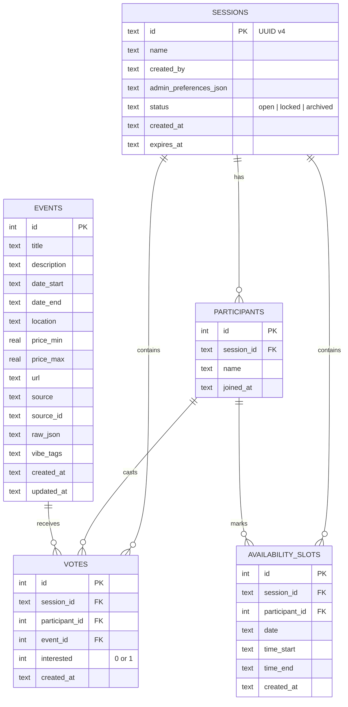

# YesCount -- Data Model PRD

> Sub-PRD of [PRD_MASTER.md](PRD_MASTER.md)

---

## 1. Overview

This document defines every persistent data structure in YesCount: five SQLite tables for structured data, one ChromaDB collection for vector search, the normalization rules that map raw source data into the canonical schema, and the embedding strategy.

---

## 2. SQLite Schema

Database file: `data/yescount.db` (path configurable via `SQLITE_DB_PATH` env var).

**Durability note:** local file paths are acceptable for local development and MVP demos, but production requires durable storage and backup/restore capability.

### 2.1 `events`

Stores every ingested event after normalization.

```sql
CREATE TABLE IF NOT EXISTS events (
    id              INTEGER PRIMARY KEY AUTOINCREMENT,
    title           TEXT    NOT NULL,
    description     TEXT    NOT NULL DEFAULT '',
    date_start      TEXT    NOT NULL,   -- ISO 8601: YYYY-MM-DDTHH:MM:SS
    date_end        TEXT,               -- nullable; some events have no end time
    location        TEXT    NOT NULL DEFAULT '',
    price_min       REAL,               -- nullable; 0.0 = free
    price_max       REAL,               -- nullable; same as min for single-price
    url             TEXT    NOT NULL DEFAULT '',
    source          TEXT    NOT NULL CHECK(source IN ('nyc_open_data', 'scraped')),
    source_id       TEXT,               -- original ID from the source, for dedup
    raw_json        TEXT,               -- original payload for debugging
    vibe_tags       TEXT    NOT NULL DEFAULT '[]',  -- JSON array of strings
    created_at      TEXT    NOT NULL DEFAULT (datetime('now')),
    updated_at      TEXT    NOT NULL DEFAULT (datetime('now')),
    UNIQUE(source, source_id)
);

CREATE INDEX idx_events_date_start ON events(date_start);
CREATE INDEX idx_events_source ON events(source);
```

**Column notes:**

- `date_start` / `date_end`: stored as ISO 8601 text for SQLite compatibility; parsed as `datetime` in Python.
- `price_min` / `price_max`: NULL means price unknown; 0.0 means free.
- `vibe_tags`: a JSON-serialized list of lowercase strings (e.g., `["immersive", "artsy", "outdoor"]`). Initially populated heuristically from description keywords; can be refined by LLM tagging.
- `source_id`: the event's original identifier in its source system, combined with `source` to form a natural dedup key.

### 2.2 `sessions`

Each session represents one coordination plan.

```sql
CREATE TABLE IF NOT EXISTS sessions (
    id                      TEXT PRIMARY KEY,  -- UUID v4
    name                    TEXT NOT NULL,
    created_by              TEXT NOT NULL,       -- Connector's display name
    admin_preferences_json  TEXT NOT NULL DEFAULT '{}',
    status                  TEXT NOT NULL DEFAULT 'open'
                            CHECK(status IN ('open', 'locked', 'archived')),
    created_at              TEXT NOT NULL DEFAULT (datetime('now')),
    expires_at              TEXT NOT NULL         -- default: created_at + 7 days
);
```

**`admin_preferences_json` schema:**

```json
{
  "budget_cap": 50.0,
  "vibe_tags": ["immersive", "artsy"],
  "min_attendees": 3,
  "blackout_dates": ["2026-03-15"],
  "date_range_start": "2026-03-01",
  "date_range_end": "2026-03-31"
}
```

### 2.3 `participants`

Users who have joined a session.

```sql
CREATE TABLE IF NOT EXISTS participants (
    id          INTEGER PRIMARY KEY AUTOINCREMENT,
    session_id  TEXT    NOT NULL REFERENCES sessions(id) ON DELETE CASCADE,
    name        TEXT    NOT NULL,
    joined_at   TEXT    NOT NULL DEFAULT (datetime('now')),
    UNIQUE(session_id, name)  -- one name per session
);
```

### 2.4 `votes`

Interest signals on events within a session.

```sql
CREATE TABLE IF NOT EXISTS votes (
    id              INTEGER PRIMARY KEY AUTOINCREMENT,
    session_id      TEXT    NOT NULL REFERENCES sessions(id) ON DELETE CASCADE,
    participant_id  INTEGER NOT NULL REFERENCES participants(id) ON DELETE CASCADE,
    event_id        INTEGER NOT NULL REFERENCES events(id) ON DELETE CASCADE,
    interested      INTEGER NOT NULL CHECK(interested IN (0, 1)),  -- 0 = skip, 1 = yes
    created_at      TEXT    NOT NULL DEFAULT (datetime('now')),
    UNIQUE(session_id, participant_id, event_id)
);

CREATE INDEX idx_votes_session ON votes(session_id);
CREATE INDEX idx_votes_event ON votes(session_id, event_id);
```

### 2.5 `availability_slots`

Time windows a participant marks as free.

```sql
CREATE TABLE IF NOT EXISTS availability_slots (
    id              INTEGER PRIMARY KEY AUTOINCREMENT,
    session_id      TEXT    NOT NULL REFERENCES sessions(id) ON DELETE CASCADE,
    participant_id  INTEGER NOT NULL REFERENCES participants(id) ON DELETE CASCADE,
    date            TEXT    NOT NULL,   -- YYYY-MM-DD
    time_start      TEXT    NOT NULL,   -- HH:MM (24h)
    time_end        TEXT    NOT NULL,   -- HH:MM (24h)
    created_at      TEXT    NOT NULL DEFAULT (datetime('now')),
    UNIQUE(session_id, participant_id, date, time_start, time_end)
);

CREATE INDEX idx_availability_session ON availability_slots(session_id);
```

---

## 3. Entity-Relationship Diagram



---

## 3.1 Key Read Patterns

### Session Preview (Join Screen)

When an invited friend opens a session link, the app needs a composite read across multiple tables to render the personalized welcome screen ("Join Ema's Crew Night Out"). No schema changes are required -- this is a read-only aggregate over existing tables.

**Query:**

```sql
-- 1. Session metadata
SELECT id, name, created_by, status, admin_preferences_json, expires_at
FROM sessions
WHERE id = :session_id;

-- 2. Participant names
SELECT name FROM participants
WHERE session_id = :session_id
ORDER BY joined_at;

-- 3. Top-voted events (up to 3)
SELECT e.title, COUNT(*) as vote_count
FROM votes v
JOIN events e ON v.event_id = e.id
WHERE v.session_id = :session_id AND v.interested = 1
GROUP BY v.event_id
ORDER BY vote_count DESC
LIMIT 3;
```

These three queries are assembled into a `SessionPreview` object by `sessions/manager.py::get_session_preview()`. The frontend uses this to display: session name, creator name, who has joined so far, admin-set vibe tags and date range (parsed from `admin_preferences_json`), and a teaser of the most popular events.

No new columns or tables are needed -- the existing `sessions.name`, `sessions.created_by`, `sessions.admin_preferences_json`, `participants.name`, and the `votes`/`events` join provide everything.

---

## 4. ChromaDB Collection

**Collection name:** `event_embeddings`

**Persist directory:** configurable via `CHROMA_PERSIST_DIR` env var (default `data/chroma/`).

### 4.1 Document Construction

Each event becomes one document in ChromaDB. The document text is a concatenation:

```
{title} | {location} | {description}
```

Pipe-delimited to give the embedding model clear field boundaries.

### 4.2 Metadata

Each document carries metadata for post-retrieval filtering:

| Key | Type | Example |
|-----|------|---------|
| `event_id` | int | `42` |
| `date_start` | str (ISO date) | `"2026-03-15"` |
| `price_min` | float | `0.0` |
| `price_max` | float | `25.0` |
| `source` | str | `"nyc_open_data"` |
| `vibe_tags` | str (JSON array) | `'["immersive","artsy"]'` |

### 4.3 ID Scheme

ChromaDB document ID = `"event_{events.id}"` (e.g., `"event_42"`).

### 4.4 Embedding Model

`text-embedding-3-small` from OpenAI (1536 dimensions). Called via the OpenAI Python SDK.

---

## 5. Data Normalization Rules

Raw data from each source must be mapped to the `events` table schema.

### 5.1 NYC Open Data (Socrata API)

Source endpoint: `https://data.cityofnewyork.us/resource/{dataset_id}.json`

| Source Field | Maps To | Transform |
|-------------|---------|-----------|
| `event_name` or `title` | `title` | Strip whitespace, title-case |
| `description` or `short_description` | `description` | Strip HTML tags, truncate to 2000 chars |
| `start_date_time` | `date_start` | Parse to ISO 8601 |
| `end_date_time` | `date_end` | Parse to ISO 8601; NULL if missing |
| `location` or `event_location` | `location` | Concatenate venue + address if separate |
| `free` (bool) | `price_min` / `price_max` | If true -> 0.0 / 0.0; else NULL |
| `event_url` or `url` | `url` | Validate URL; empty string if invalid |
| -- | `source` | `"nyc_open_data"` |
| `event_id` or row ID | `source_id` | Cast to string |

### 5.2 Web-Scraped Events

Normalization depends on the target site. Each scraper must implement a `normalize(raw: dict) -> dict` method that returns a dict matching the `events` column names. Required fields: `title`, `date_start`, `source` (always `"scraped"`), `source_id`.

Common transforms:
- Parse human-readable dates ("Sat, Mar 15 at 7 PM") to ISO 8601.
- Extract price from strings like "$25" or "Free" to `price_min` / `price_max`.
- Strip HTML entities and markdown from descriptions.

---

## 6. Embedding Strategy

### 6.1 When to Embed

- **On ingest**: after a new event is inserted into SQLite, embed it and upsert into ChromaDB.
- **On update**: if `title`, `description`, or `location` change, re-embed and upsert.
- **Batch refresh**: a nightly job re-embeds all events to capture any retroactive corrections.

### 6.2 Chunking

No chunking required. Event text (title + location + description) is typically 100-300 tokens, well within the 8191-token context window of `text-embedding-3-small`.

### 6.3 Deduplication

Before upserting into ChromaDB, check if `event_{id}` already exists. ChromaDB's `upsert` handles this natively.

### 6.4 Cost Estimate

At 5,000 events averaging 200 tokens each: ~1M tokens per full embed. At $0.02 / 1M tokens for `text-embedding-3-small`, a full refresh costs ~$0.02.

---

## 7. Migration Plan

SQLite migrations are managed via numbered Python scripts in `migrations/`:

```
migrations/
    001_create_events.py
    002_create_sessions.py
    003_create_participants.py
    004_create_votes.py
    005_create_availability_slots.py
```

Each migration change must provide:
1. An **up** path (apply schema change).
2. A **down** path (rollback) or an explicit documented restore procedure.
3. A migration identifier recorded in `_migrations`.
4. An integrity check after apply/rollback.

The `_migrations` tracking table:

```sql
CREATE TABLE IF NOT EXISTS _migrations (
    id          INTEGER PRIMARY KEY AUTOINCREMENT,
    name        TEXT    NOT NULL UNIQUE,
    applied_at  TEXT    NOT NULL DEFAULT (datetime('now'))
);
```

Running migrations: `python -m db.migrate` applies all pending migrations in order.

### 7.1 Rollback and Recovery Expectations

- Before schema-changing deploys, take a restorable data snapshot/backup.
- If migration apply fails, startup must fail and no partially migrated runtime should be served.
- If post-deploy validation fails, rollback to previous schema/app version before reopening traffic.
