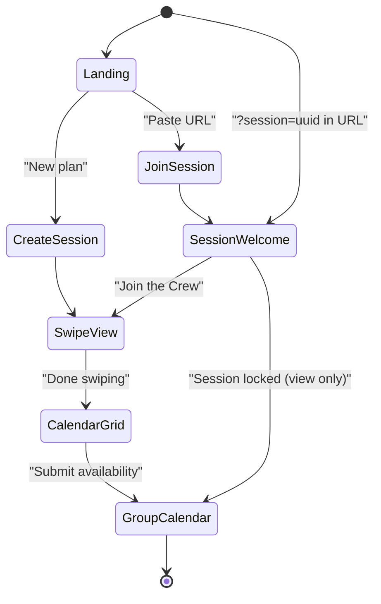

# YesCount -- Frontend PRD

> Sub-PRD of [PRD_MASTER.md](PRD_MASTER.md)

---

## 1. Overview

YesCount's frontend is a single Streamlit application (`app.py`) that renders three core views and a session management flow. There is no separate API layer -- the Streamlit script imports backend modules directly. This document specifies every view, its components, state management, and Streamlit-specific implementation patterns.

### 1.1 Current Implementation Notes (2026-02)

This PRD contains aspirational layout detail; the following shipped behavior is authoritative for the current build:

- Landing includes hero media (`assets/yescount-hero.png`) with fallback branding and create/join CTA cards.
- Session date range is hard-capped to 31 days from selected start date (UI + server guard).
- Voting screen uses curated websites-only cards (max 30), with monthly target/deadline messaging.
- Event cards use a 3-column masonry presentation with image-first cards and fallback placeholders when media is unavailable.
- Card copy uses LLM-generated short title and summary when available.
- Event cards show compact schedule labels:
  - specific date for single-date events,
  - concise date ranges when start/end are present,
  - `Multiple dates` for recurring or unclear schedules.
- Vote control copy on cards: `Yes! Count me in!`.
- Availability UI is simplified to a single evening slot per day with tri-state controls (`No response`, `Available`, `Unavailable`).
- Results show interested participant names per event and best overlap dates/times.

---

## 2. Application Shell

### 2.1 Page Configuration

```python
st.set_page_config(
    page_title="YesCount - NYC Social Planner",
    page_icon="🎉",
    layout="wide",
    initial_sidebar_state="collapsed",
)
```

### 2.2 Navigation Model

The app uses a linear flow driven by `st.session_state["current_view"]`:



A navigation bar at the top shows breadcrumbs: **Landing > Swipe > Availability > Results**. For invited friends arriving via link, the flow starts at **Session Welcome > Swipe > Availability > Results**. Users can navigate back to any completed step.

### 2.3 Sidebar

The sidebar is minimal and context-dependent:

| View | Sidebar Contents |
|------|-----------------|
| Landing | App logo, tagline, version |
| Swipe View | Filters: date range picker, price slider, vibe tag checkboxes |
| Calendar Grid | Participant selector dropdown, session info |
| Group Calendar | Session info, "Copy Invite" button, "New Plan" button |

---

## 3. View Specifications

### 3.1 Landing Page

**Purpose:** Entry point. Route to session creation or join.

**Layout (default -- no session in URL):**

```
┌─────────────────────────────────────────────┐
│              🎉 YesCount                     │
│        NYC Social Planner                    │
│                                              │
│  ┌──────────────────┐ ┌──────────────────┐  │
│  │  Create a Plan   │ │  Join a Plan     │  │
│  │  [button]        │ │  [paste URL]     │  │
│  └──────────────────┘ └──────────────────┘  │
│                                              │
│  "Find the best events for your crew"       │
└─────────────────────────────────────────────┘
```

**Components:**
- `st.title("YesCount")` with custom CSS for branding
- Two `st.columns` for the two paths
- **Create path**: `st.text_input` for plan name, `st.text_input` for Connector name, `st.button("Create Plan")`
- **Join path**: `st.text_input` for session URL or ID, `st.text_input` for participant name, `st.button("Join")`

**Admin preferences** (shown only on Create path, inside an expander):
- `st.number_input` for budget cap
- `st.multiselect` for vibe tags (from curated list)
- `st.number_input` for minimum attendees
- `st.date_input` for date range (start/end)
- `st.multiselect` for blackout dates

### 3.1.1 Session Welcome Page (Personalized Join)

**Purpose:** When a friend clicks a shareable session link (`?session=<uuid>`), they see a warm, personalized welcome screen instead of the generic landing page. This is the first thing invited friends experience.

**Trigger:** URL contains `?session=<uuid>` and the visitor is not yet a participant in the session.

**Input validation requirements:**
- Participant name is trimmed and must be 1-50 characters.
- Allowed characters are letters, numbers, spaces, apostrophes, and hyphens.
- Invalid names show inline validation errors and do not call `manager.join_session`.

**Data source:** `manager.get_session_preview(session_id)` returns a `SessionPreview` with session name, creator name, participant names, top voted events, admin vibe tags, and date range -- all without requiring the visitor to join first.

**Layout:**

```
┌──────────────────────────────────────────────────────┐
│                  🎉 YesCount                          │
│                                                       │
│  ┌──────────────────────────────────────────────────┐│
│  │                                                    ││
│  │   Join Ema's Crew Night Out!                      ││
│  │                                                    ││
│  │   📅 Mar 9 - Mar 15  ·  🏷️ immersive, artsy      ││
│  │   👥 3 friends already in: Ema, Jake, Mia         ││
│  │                                                    ││
│  │   ┌─ What's hot so far ───────────────────────┐  ││
│  │   │  🎵 Jazz in the Park          3 votes     │  ││
│  │   │  🎭 Sleep No More             2 votes     │  ││
│  │   │  🍕 Smorgasburg BK            2 votes     │  ││
│  │   └───────────────────────────────────────────┘  ││
│  │                                                    ││
│  │   Your name: [_______________]                    ││
│  │                                                    ││
│  │           [ ✅ Join the Crew ]                     ││
│  │                                                    ││
│  └──────────────────────────────────────────────────┘│
│                                                       │
│  or  [Create your own plan →]                        │
└──────────────────────────────────────────────────────┘
```

**Components:**

| Component | Streamlit Widget | Details |
|-----------|-----------------|---------|
| Session title | `st.header` | Dynamic: `"Join {created_by}'s {session_name}"` |
| Session meta | `st.caption` | Date range and vibe tags from admin preferences |
| Participant list | `st.markdown` | Names of friends who have already joined, with count |
| Top events preview | `st.container` with styled rows | Up to 3 top-voted events (title + vote count). Read-only teaser to build excitement. Only shown if at least 1 vote has been cast. |
| Name input | `st.text_input` | Placeholder: "Enter your name" |
| Join button | `st.button("Join the Crew")` | Calls `manager.join_session(session_id, name)`. On success, sets `st.session_state` and navigates to Swipe View. |
| Create-own link | `st.button` (secondary) | Small link below for visitors who want to start their own session |

**Title construction logic:**

```python
preview = manager.get_session_preview(session_id)
st.header(f"Join {preview.created_by}'s {preview.session_name}!")
```

Examples:
- "Join Ema's Crew Night Out!"
- "Join Alex's Birthday Weekend!"
- "Join Sam's Friday Vibes!"

**Edge cases:**

| Scenario | Behavior |
|----------|----------|
| Session expired or archived | Show "This session has expired" with a "Create your own plan" button |
| Session is locked | Show the welcome screen but replace Join button with "This session is locked -- view results only". Navigate to Group Calendar. |
| Visitor is already a participant (name match) | Skip the welcome screen, resume where they left off (Swipe or Calendar) |
| No votes yet | Hide the "What's hot" section; show "Be the first to vote!" instead |
| Zero participants so far | Show "You'll be the first to join!" instead of the participant list |

**State management:**
- `st.session_state["session_preview"]`: cached `SessionPreview` object (refreshed on page load)
- On successful join, sets `session_id`, `participant_id`, `participant_name`, `is_connector=False`, and transitions `current_view` to `"swipe"`

### 3.2 Tinder-Style Swipe View

**Purpose:** Quickly signal interest in events. The default view after joining a session.

**Layout:**

```
┌─────────────────────────────────────────────┐
│  🔍 [Search bar: "cheap art this weekend"] │
│                                              │
│  ┌─────────────────────────────────────┐    │
│  │          EVENT CARD                  │    │
│  │  ┌─────────────────────────────┐    │    │
│  │  │   [Image placeholder]       │    │    │
│  │  └─────────────────────────────┘    │    │
│  │  Title: Jazz in the Park            │    │
│  │  📅 Mar 15, 7:00 PM                │    │
│  │  📍 Central Park, Naumburg Bandshell│    │
│  │  💰 Free                            │    │
│  │  🏷️ #music #outdoor #free          │    │
│  │                                      │    │
│  │  "Live jazz ensemble performing..."  │    │
│  │                                      │    │
│  │   [  ❌ Skip  ]    [  ✅ Yes!  ]    │    │
│  └─────────────────────────────────────┘    │
│                                              │
│  Card 3 of 15                    [Done →]   │
└─────────────────────────────────────────────┘
```

**Components:**

| Component | Streamlit Widget | Details |
|-----------|-----------------|---------|
| Search bar | `st.text_input` | Triggers RAG pipeline on Enter; replaces event stack with search results |
| Event card container | `st.container` + custom CSS | Centered, max-width 500px, rounded corners, subtle shadow |
| Image placeholder | `st.image` or colored `st.container` | Gradient placeholder if no image URL; real image if available |
| Title | `st.subheader` | Bold, 20px |
| Date/Location/Price | `st.caption` or `st.markdown` | Icon-prefixed metadata line |
| Vibe tags | `st.markdown` with badge CSS | Colored pills |
| Description | `st.markdown` | 2-line truncation with "more" expander |
| Skip button | `st.button("❌ Skip")` | Left column; records `interested=False` |
| Yes button | `st.button("✅ Yes!")` | Right column; records `interested=True` |
| Progress | `st.progress` + `st.caption` | "Card X of Y" |
| Done button | `st.button("Done →")` | Advances to Calendar Grid; visible after at least 1 swipe |
| Event link | `st.markdown` with `target="_blank"` | Opens event URL in new tab |

**State management:**
- `st.session_state["swipe_index"]`: current card index (int)
- `st.session_state["event_stack"]`: list of event dicts to swipe through
- `st.session_state["search_query"]`: last search query string

**Behavior:**
1. On load, the event stack is populated by `retriever.retrieve_events()` with the session's date range and admin preferences as filters. If no search query, events are sorted by date (soonest first).
2. Pressing Yes/Skip calls `voting.cast_vote()` and increments `swipe_index`.
3. Pressing the search bar re-populates the event stack from RAG results, resets `swipe_index` to 0.
4. The sidebar filters (date, price, vibe) re-trigger the retriever with updated parameters.

**Failure-state UX requirements:**
- Search input is validated (non-empty after trim, max 500 chars) before triggering RAG retrieval.
- While a search is running, search input and swipe buttons are disabled and a loading state is shown.
- Search requests time out at 30 seconds with a user-friendly retry message.
- Vote write failures must not advance the card index; the UI stays on the same card and shows an error toast.

### 3.3 Availability Calendar Grid

**Purpose:** Each participant marks their available evening time slots for the upcoming week.

**Layout:**

```
┌──────────────────────────────────────────────────────────┐
│  📅 Mark Your Availability                                │
│  Participant: [dropdown: Alice ▾]                         │
│                                                           │
│  Week of Mar 9 - Mar 15, 2026                            │
│  ┌───────┬───────┬───────┬───────┬───────┬───────┬─────┐│
│  │       │ Mon   │ Tue   │ Wed   │ Thu   │ Fri   │ Sat ││
│  ├───────┼───────┼───────┼───────┼───────┼───────┼─────┤│
│  │ 5-7pm │  [ ]  │  [✓]  │  [ ]  │  [✓]  │  [✓]  │ [✓]││
│  ├───────┼───────┼───────┼───────┼───────┼───────┼─────┤│
│  │ 7-9pm │  [✓]  │  [✓]  │  [ ]  │  [✓]  │  [✓]  │ [✓]││
│  ├───────┼───────┼───────┼───────┼───────┼───────┼─────┤│
│  │9-11pm │  [ ]  │  [ ]  │  [ ]  │  [✓]  │  [✓]  │ [✓]││
│  └───────┴───────┴───────┴───────┴───────┴───────┴─────┘│
│                                                           │
│  [Submit Availability]        [← Back to Swipe]          │
└──────────────────────────────────────────────────────────┘
```

**Components:**

| Component | Streamlit Widget | Details |
|-----------|-----------------|---------|
| Participant dropdown | `st.selectbox` | Populated from `sqlite_client.get_participants(session_id)` |
| Week navigation | `st.date_input` or arrows | Navigate between weeks within the session's date range |
| Calendar grid | `st.columns` (7 cols) x `st.checkbox` (3 rows per col) | Each checkbox = one availability slot |
| Submit button | `st.button("Submit Availability")` | Calls `availability.set_availability()` with all checked slots |
| Back button | `st.button` | Returns to Swipe View |

**Time slots:** Three fixed evening blocks per day:
- 5:00 PM - 7:00 PM
- 7:00 PM - 9:00 PM
- 9:00 PM - 11:00 PM

**State management:**
- `st.session_state["availability_grid"]`: dict of `{(date, time_slot): bool}` for the active participant
- Pre-populated from DB if the participant previously submitted

**Behavior:**
1. On load, fetch existing availability for the selected participant and pre-check the boxes.
2. Changing the participant dropdown reloads the grid with that participant's data.
3. Submit persists all checked slots to the DB and shows a success toast.
4. After submit, a prompt encourages navigating to the Group Calendar.

### 3.4 Rich Group Calendar View

**Purpose:** Read-only view showing group overlap, recommended events pinned to the best slots, and a shareable invite.

**Layout:**

```
┌──────────────────────────────────────────────────────────┐
│  🏆 Group Results                                         │
│                                                           │
│  ┌─ Top Recommendations ────────────────────────────────┐│
│  │ 1. Jazz in the Park   │ Fri Mar 13, 7-9pm │ Score 92││
│  │    👥 Alice, Bob, Carol │ 💰 Free            │        ││
│  │ 2. Comedy Cellar Show  │ Sat Mar 14, 9-11pm│ Score 85││
│  │    👥 Alice, Carol, Dan │ 💰 $15             │        ││
│  └──────────────────────────────────────────────────────┘│
│                                                           │
│  Week of Mar 9 - Mar 15, 2026                            │
│  ┌───────┬────────┬────────┬────────┬────────┬─────────┐│
│  │       │  Mon   │  Tue   │  Wed   │  Thu   │  Fri    ││
│  ├───────┼────────┼────────┼────────┼────────┼─────────┤│
│  │ 5-7pm │ ░░ 1/4 │ ██ 3/4 │ ░░ 0/4 │ ██ 3/4 │ ██ 4/4 ││
│  ├───────┼────────┼────────┼────────┼────────┼─────────┤│
│  │ 7-9pm │ ██ 2/4 │ ██ 3/4 │ ░░ 1/4 │ ██ 4/4 │ ██ 4/4 ││
│  │       │        │        │        │        │ 🎵 Jazz ││
│  ├───────┼────────┼────────┼────────┼────────┼─────────┤│
│  │9-11pm │ ░░ 0/4 │ ░░ 1/4 │ ░░ 0/4 │ ██ 2/4 │ ██ 3/4 ││
│  └───────┴────────┴────────┴────────┴────────┴─────────┘│
│                                                           │
│  Click a cell to see: Alice ✓, Bob ✓, Carol ✓, Dan ✗    │
│                                                           │
│  ┌─ Invite Text ────────────────────────────────────────┐│
│  │ 🎉 YesCount Pick: Jazz in the Park                   ││
│  │ 📅 Fri Mar 13, 7-9pm │ 📍 Central Park              ││
│  │ 💰 Free │ 👥 Alice, Bob, Carol                       ││
│  │ 🔗 https://...                                       ││
│  │                                [📋 Copy to Clipboard]││
│  └──────────────────────────────────────────────────────┘│
└──────────────────────────────────────────────────────────┘
```

**Components:**

| Component | Streamlit Widget | Details |
|-----------|-----------------|---------|
| Recommendation cards | `st.container` + `st.columns` | Top-N ranked recommendations with score, attendees, price |
| Calendar heatmap | `st.columns` (7) x custom `st.markdown` | Cells color-coded: low overlap (light) -> high overlap (dark) |
| Cell detail | `st.popover` or `st.expander` | On click, shows list of available/unavailable participants |
| Event pins | `st.markdown` inside calendar cells | Small badge showing the recommended event name in its slot |
| Invite text box | `st.text_area` (readonly) | Pre-generated invite text for the top recommendation |
| Copy button | `st.button` + JS clipboard via `st.components.v1.html` | Copies invite text to clipboard |
| Event links | `st.markdown` | External links open in new tab |

**Clipboard fallback behavior:**
- If clipboard API is unavailable or copy fails, show selectable invite text plus "Press Ctrl/Cmd+C to copy manually."
- Copy failures are non-fatal and must not block recommendations view usage.

**Color scale for overlap density:**

| Overlap | Color | Label |
|---------|-------|-------|
| 0% | Light gray | No one available |
| 1-25% | Light green | Low overlap |
| 26-50% | Medium green | Moderate overlap |
| 51-75% | Green | Good overlap |
| 76-100% | Dark green / bold | Best overlap |

**State management:**
- `st.session_state["selected_cell"]`: `(date, time_slot)` for detail popover
- `st.session_state["active_recommendation"]`: index of the recommendation whose invite text is shown

**Behavior:**
1. On load, call `recommender.compute_recommendations(session_id)` to get top-5 scored results.
2. Render the recommendation cards at the top.
3. Build the calendar heatmap from `availability.get_group_availability(session_id)`.
4. Pin recommended events to their matched time slots in the grid.
5. Clicking a cell shows a popover with participant names and their status.
6. The invite text box auto-populates for the #1 recommendation; switching recommendation cards updates it.

---

## 4. Session Management Flow

### 4.1 URL Routing via Query Parameters

```python
params = st.query_params
session_id = params.get("session", None)

if session_id:
    if not manager.is_session_valid(session_id):
        show_session_expired()
    elif is_returning_participant(session_id):
        resume_session(session_id)          # skip welcome, go to last view
    else:
        show_session_welcome(session_id)    # personalized join screen (3.1.1)
else:
    show_landing_page()
```

**`is_returning_participant` check:**

```python
def is_returning_participant(session_id: str) -> bool:
    """True if the visitor's name is already in the session's participant list."""
    return (
        st.session_state.get("participant_name") is not None
        and st.session_state.get("session_id") == session_id
    )
```

### 4.2 Session State Machine (Frontend)

```python
if st.session_state["current_view"] == "landing":
    render_landing()
elif st.session_state["current_view"] == "swipe":
    render_swipe_view()
elif st.session_state["current_view"] == "calendar":
    render_calendar_grid()
elif st.session_state["current_view"] == "results":
    render_group_calendar()
```

### 4.3 Connector vs. Participant Awareness

The Connector (session creator) sees additional controls:
- "Lock Session" button in the sidebar (visible in Swipe and Calendar views)
- Admin preferences editor (expandable in sidebar)
- Participant progress indicator: "3 of 5 friends have voted"

Participants see a read-only info bar: "Session by Alice | 5 friends joined"

---

## 5. Streamlit-Specific Patterns

### 5.1 State Initialization

```python
DEFAULTS = {
    "current_view": "landing",
    "session_id": None,
    "participant_id": None,
    "participant_name": None,
    "is_connector": False,
    "session_preview": None,
    "swipe_index": 0,
    "event_stack": [],
    "search_query": "",
    "availability_grid": {},
    "selected_cell": None,
    "active_recommendation": 0,
}

for key, default in DEFAULTS.items():
    if key not in st.session_state:
        st.session_state[key] = default
```

### 5.2 Custom CSS

Injected once at app startup via `st.markdown("""<style>...</style>""", unsafe_allow_html=True)`.

Key styles:
- `.event-card`: max-width 500px, border-radius 16px, box-shadow, centered
- `.vibe-tag`: inline-block pill, colored background, small font
- `.calendar-cell`: fixed size, border, text-align center
- `.overlap-high`: dark green background, white text
- `.overlap-low`: light gray background

### 5.3 Rerun Management

Streamlit reruns the entire script on every interaction. To avoid redundant computation:
- Cache `retriever.retrieve_events()` results with `@st.cache_data(ttl=300)` (5-min TTL).
- Cache DB reads (votes, availability) with `@st.cache_data(ttl=60)`.
- Use `st.session_state` to persist UI state across reruns.
- Guard expensive operations behind `if st.session_state["trigger_x"]:` flags.

**Cache invalidation requirements:**
- After `voting.cast_vote()`, invalidate cached vote/session summary reads.
- After `availability.set_availability()`, invalidate cached availability/group overlap reads.
- After session lock/archive actions, invalidate cached session preview and recommendation inputs.

### 5.4 Responsive Layout

- Use `st.columns([1, 2, 1])` to center the event card on wide screens.
- Calendar grid uses equal `st.columns(7)` for days.
- Mobile: Streamlit's default responsive behavior collapses columns vertically, which is acceptable for MVP.

---

## 6. Accessibility

| Feature | Implementation |
|---------|---------------|
| Keyboard navigation | Yes/Skip buttons are standard `st.button` (Tab-focusable) |
| Screen reader support | All images have alt text; data tables use `st.dataframe` |
| Color contrast | Calendar heatmap colors meet WCAG AA (4.5:1 ratio) |
| Focus indicators | Default Streamlit focus rings retained |
| Text sizing | Base font 16px; no text below 12px |
