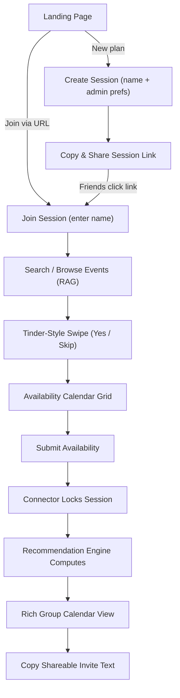
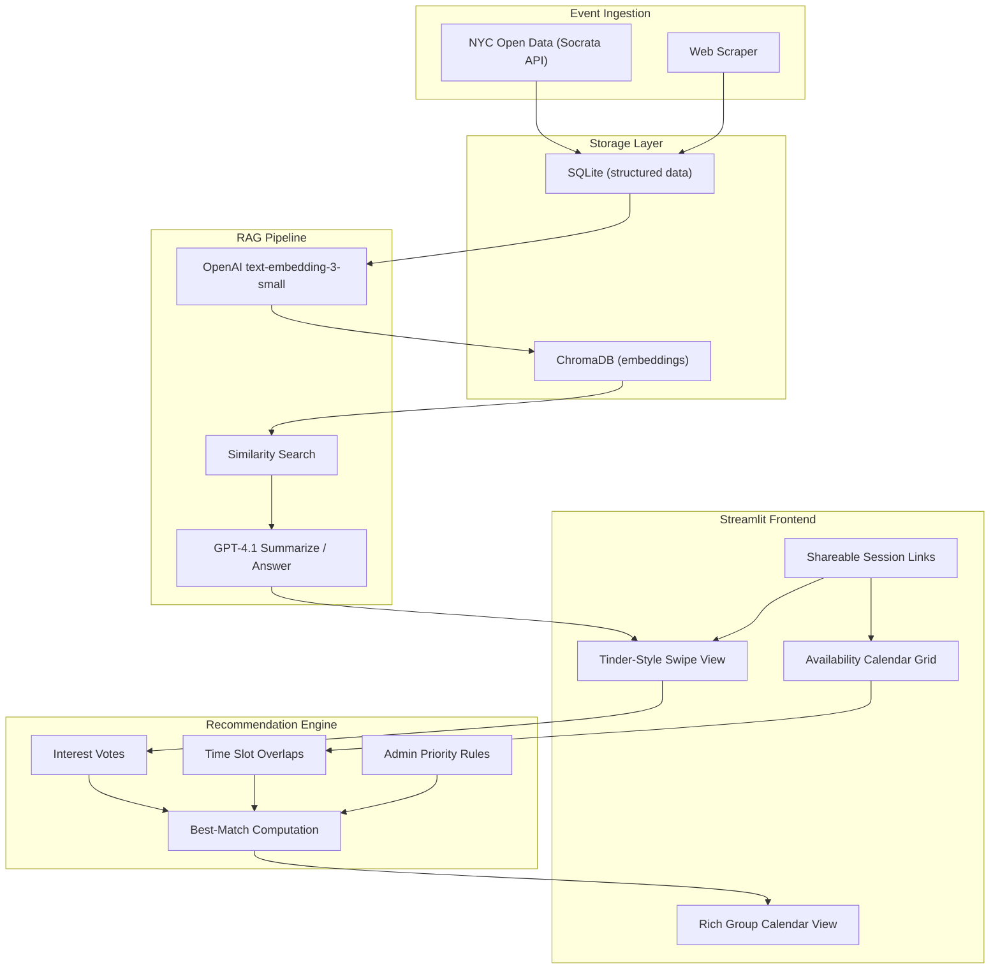

# YesCount -- Master PRD

## 1. Product Vision

**YesCount** is a Streamlit-based NYC Social Planner that eliminates the friction of coordinating group outings in New York City. It aggregates text-based event listings from public sources, lets users discover events through a natural-language RAG search and a Tinder-style swipe interface, and then helps a circle of friends converge on the best event-time combination through collaborative voting and availability matching.

### Problem Statement

Organizing a group outing in NYC today requires juggling multiple event-listing sites, a group chat full of "maybe"s, and manual schedule comparison. The result is decision paralysis: plans fall through or default to the lowest-common-denominator option.

### Solution

YesCount provides a single flow:

1. **Discover** -- events are ingested, normalized, and searchable via plain English.
2. **Swipe** -- each friend quickly signals interest (yes/skip) on curated event cards.
3. **Schedule** -- each friend marks their available time slots on a calendar grid.
4. **Decide** -- an algorithm computes the best event-time combinations, factoring in group overlap and admin-set priorities (budget, vibe, minimum attendees).
5. **Share** -- a ready-made invite with event details and links is generated for copy/paste.

---

## 2. Target Users and Personas

| Persona | Description | Goals |
|---------|-------------|-------|
| **The Connector** (session creator) | The friend who always organizes. Creates a plan session, sets admin preferences (budget cap, vibe tags, blackout dates), and shares the link. | Quickly surface good options, drive the group to a decision, minimize back-and-forth. |
| **The Participant** (session joiner) | Any friend who receives the session link. Swipes on events and marks availability. | Low-effort participation -- spend < 2 minutes, feel heard. |

---

## 3. Core User Stories

| ID | As a... | I want to... | So that... |
|----|---------|-------------|------------|
| US-01 | Connector | create a new plan session with a name and my preferences | I can start coordinating a group outing |
| US-02 | Connector | share a session link with friends | they can join without creating accounts |
| US-03 | Participant | join a session by clicking a link and entering my name | I can participate without signing up |
| US-04 | Participant | search for events using natural language (e.g., "cheap immersive art this weekend") | I find events that match what I'm in the mood for |
| US-05 | Participant | swipe through event cards (yes/skip) in a Tinder-style view | I can quickly signal my interest |
| US-06 | Participant | mark my available time slots on a weekly calendar grid | the group knows when I'm free |
| US-07 | Connector | set admin priority rules (budget cap, vibe tags, min attendees, blackout dates) | the recommendation reflects my planning constraints |
| US-08 | Participant | view a group calendar showing who is available when and for which events | I can see where overlap is highest |
| US-09 | Participant | see a ranked list of recommended event-time combinations | the group can quickly agree on a plan |
| US-10 | Participant | copy a shareable invite text with event details and links | I can paste it into a group chat to finalize the plan |
| US-11 | Connector | see how many friends have voted and submitted availability | I know when to lock the session and generate recommendations |
| US-12 | Participant | filter events by date range, price, and vibe tags in the swipe view | I only see events relevant to me |

---

## 4. User Flow

---

## 5. Architecture Overview

### Tech Stack

| Layer | Choice |
|-------|--------|
| Frontend | Streamlit |
| Structured DB | Hosted Postgres (Neon) in deployment; SQLite fallback for local/dev |
| Vector DB | ChromaDB |
| LLM | OpenAI GPT-4.1 |
| Embeddings | OpenAI `text-embedding-3-small` |
| Event Sources | Required website scraping targets (6 configured sources); voting list is websites-only curated cards |
| Multi-user | Shareable session link (URL-based, no auth) |
| Deployment | GitHub + Streamlit Community Cloud |

### Deployment and Data Durability Policy

- **MVP deployment target:** Streamlit Community Cloud.
- **Durability reality on Streamlit Cloud:** local disk is ephemeral; `data/yescount.db` and `data/chroma/` are not durable across restarts.
- **MVP policy:** data loss across restarts is acceptable only for demo/MVP environments.
- **Production policy:** durable persistence is required (hosted SQL + durable vector store, or equivalent external storage) before production launch.

### Sub-PRD Cross-References

| Document | Scope |
|----------|-------|
| [PRD_DATA_MODEL.md](PRD_DATA_MODEL.md) | SQLite schemas, ChromaDB collection, ER diagram, normalization, embedding strategy |
| [PRD_BACKEND.md](PRD_BACKEND.md) | Python module structure, RAG pipeline, recommendation engine, session lifecycle |
| [PRD_FRONTEND.md](PRD_FRONTEND.md) | Streamlit views, session management UI, component patterns |
| [PRD_UNIT_TESTS.md](PRD_UNIT_TESTS.md) | pytest setup, test categories, coverage targets, fixtures |
| [PRD_LOCAL_CI.md](PRD_LOCAL_CI.md) | Makefile, pre-commit hooks, GitHub Actions, dependency management |

---

## 6. Milestone Roadmap

| Milestone | Scope | Key Deliverables |
|-----------|-------|------------------|
| **M0 -- Data Pipeline** | Event ingestion and storage | Socrata client, web scraper skeleton, normalizer, SQLite schema, seed data |
| **M1 -- RAG Search** | Embedding and retrieval | ChromaDB collection, embedder, retriever, LLM summarizer, basic Streamlit search UI |
| **M2 -- Single-User Swipe + Calendar** | Core UI without sessions | Tinder-style swipe view, availability calendar grid, local state management |
| **M3 -- Multi-User Sessions** | Shareable session links | Session CRUD, participant join flow, URL routing, vote and availability persistence |
| **M4 -- Recommendation Engine** | Scoring and admin rules | Overlap computation, weighted scoring, admin preferences UI, group calendar view, invite text |
| **M5 -- Polish + Deploy** | Production readiness | UI polish, error handling, pre-commit hooks, CI workflow, Streamlit Community Cloud deploy |

---

## 7. Non-Functional Requirements

| Category | Requirement |
|----------|-------------|
| **Performance** | RAG search returns results in < 3 seconds for a corpus of up to 5,000 events |
| **Data Freshness** | Event data refreshed at least weekly on Friday via scheduled ingestion, with manual run support |
| **Concurrency** | Up to 10 concurrent participants per session (Streamlit server-side state) |
| **Browser Support** | Chrome, Firefox, Safari (latest two major versions) |
| **Accessibility** | Keyboard-navigable swipe view; sufficient color contrast on calendar grid |
| **Security** | No PII stored beyond first names; session links expire after 7 days by default |
| **Scalability** | MVP runs with hosted Postgres for durable session/vote data; vector durability remains a later track |

### 7.1 Deploy Success Criteria (Release Gates)

A deployment is considered successful only if all of the following are true:

1. **Startup validation passes:** required environment variables are present and valid, migrations are up to date, and storage dependencies initialize successfully.
2. **Health checks are green:** liveness and readiness checks pass after deploy.
3. **Quality gates pass in CI:** lint, typecheck, and tests pass on supported Python versions.
4. **Coverage gate passes:** project coverage remains at or above the agreed minimum threshold.
5. **Critical journey smoke tests pass:** create session -> join -> vote -> submit availability -> view recommendations.
6. **Rollback path is available:** previous app version and previous DB schema/data snapshot can be restored.

### 7.2 Rollback Requirements

- Every schema migration must define a rollback strategy (`down` migration or documented restore procedure).
- Pre-deploy backup/snapshot is required for persistent production data stores.
- If post-deploy health checks fail, rollback is required before reopening the app to users.

---

## 8. Glossary

| Term | Definition |
|------|------------|
| **Session** | A plan-coordination workspace created by a Connector, identified by a UUID in the URL |
| **Connector** | The user who creates a session and sets admin preferences |
| **Participant** | Any user (including the Connector) who joins a session to vote and mark availability |
| **Vote** | A binary yes/skip interest signal on an event within a session |
| **Availability Slot** | A time window (date + start/end time) that a participant marks as free |
| **Overlap Score** | The count of participants available in a given slot, normalized to [0, 1] |
| **Admin Rules** | Connector-defined constraints: budget cap, vibe tags, minimum attendees, blackout dates |
| **Recommendation** | A ranked list of (event, time slot) pairs scored by interest count, overlap, and admin weight |
| **Invite Text** | A pre-formatted message containing event title, date, location, price, URL, and who's attending |
| **RAG** | Retrieval-Augmented Generation -- embed a query, retrieve similar event documents, generate an LLM summary |
