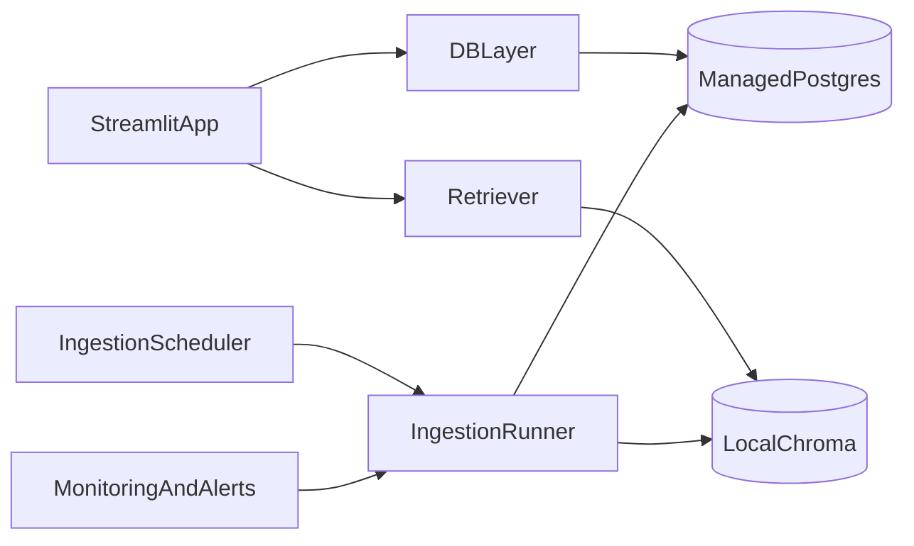

# Track B Reference: Durable SQL Now (In Progress)

> Note: For current overall architecture and decision context, use
> `docs/HYBRID_STRATEGY_HISTORY_AND_GUIDE.md` as the canonical source.
> This file remains a Track B deep reference/history document.

Status: Modified Track B in progress
Owner: YesCount team
Last updated: 2026-02-26

## Purpose

Capture the current Track B plan after scope change:
- Do now: move structured DB to hosted PostgreSQL.
- Keep Chroma local for now.
- Defer durable vector store migration to later.

## Why Track B Exists

Current deployment assumptions used local:
- SQLite (`data/yescount.db`) for sessions/votes/events.
- Chroma persistence directory (`data/chroma/`) for vectors.

On Streamlit Cloud, local disk is ephemeral. Restarts can lose data.
The highest-risk data is relational/session data (votes, availability, session state).

## In Scope (current modified Track B)

- Replace SQLite runtime dependency with managed PostgreSQL.
- Keep Chroma local temporarily.
- Keep existing app/runtime behavior and function contracts stable.
- Update environment validation, CI docs, and deploy runbooks.

## Out of Scope (for this phase)

- Migrating Chroma to durable hosted vector store.
- Retrieval parity tuning across vector backends.
- Full repository abstraction rewrite.

## Recommendation Snapshot (updated)

- Structured data now: managed PostgreSQL (do immediately).
- Vector data now: keep local Chroma (acceptable temporary compromise).
- Later: migrate vector store to durable backend.

## Preconditions for Production Cutover

1. Postgres instance provisioned and reachable from app runtime.
2. `DATABASE_URL` set in Streamlit secrets.
3. CI quality gates are green.
4. Rollback plan to SQLite fallback is available.

## Provider Decision Checklist

### PostgreSQL
- Select provider (Neon/Supabase/RDS/etc.).
- Confirm region close to app hosting.
- Confirm backup/restore and retention policy.
- Confirm connection pooling and concurrent connection limits.

### Vector Store (deferred)
- Keep current Chroma configuration.
- Accept temporary risk: semantic index may reset on restart.

## Target Architecture (current phase)

## Execution Phases (updated)

## Phase B1: Dual DB Support

- Add `DATABASE_URL` support while preserving SQLite fallback.
- Keep existing API signatures so frontend/services do not break.

## Phase B2: PostgreSQL Runtime Schema

- Ensure schema creation supports PostgreSQL and SQLite modes.
- Keep ingestion observability tables in both modes.

## Phase B3: Backfill + Verification (manual/ops)

- Export and import existing records.
- Validate row counts and spot-check key entities:
  - events
  - sessions
  - participants
  - votes
  - availability slots

## Phase B4: Vector Continuity (temporary)

- Keep local Chroma for now.
- Accept fallback behavior if vector index is unavailable.
- Optionally re-embed on scheduled ingestion runs.

## Phase B5: Readiness + Observability

- Ensure readiness checks still gate startup correctly.
- Ensure ingestion run/source checks are persisted in Postgres.
- Confirm startup validation checks `DATABASE_URL` format when provided.

## Phase B6: Staged Cutover

- Deploy to staging first and run smoke journeys.
- Enable feature flag for durable stores.
- Run rollback drill before production cutover.

## Phase B7: Production Cutover (this phase)

- Set `DATABASE_URL` in Streamlit secrets.
- Restart app and verify critical journey.
- Monitor error rates, query latency, and session persistence.

## Rollback Plan (mandatory)

- Keep prior app artifact and SQLite fallback path.
- If readiness fails post-cutover:
  1) unset `DATABASE_URL`
  2) restart app (SQLite fallback path)
  3) restore latest DB snapshot if needed
  4) rerun smoke flow before reopening

## Risks and Mitigations

- Risk: schema mismatch during migration
  - Mitigation: rehearsal on staging with full backfill dry-run
- Risk: local Chroma resets on restart
  - Mitigation: keep SQL durable now; schedule vector durability in next phase
- Risk: secrets/config mistakes at startup
  - Mitigation: strict startup validation and readiness gating

## Next-Phase Trigger (for durable vector store)

Start vector durability phase when all are true:
- SQL durability is stable in production.
- Budget/provider choice for vector service is approved.
- Staging parity tests for retrieval are defined.

## Immediate Ops Checklist

1. Provision managed PostgreSQL and obtain `DATABASE_URL`.
2. Add `DATABASE_URL` to Streamlit secrets.
3. Restart and validate: create session -> join -> vote -> availability -> results.
4. Manually run ingestion once and confirm writes persist after app restart.
5. Keep Track B (vector durability) as a separate future phase.

